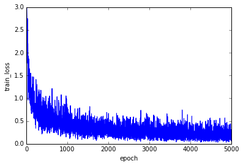

# Multi-Layer-Perceptron

Sample implementation of multi-layer-perceptron

* 4 layers perceptron
* Use mnist datasets  
* Test accuracy is about 92% 
* Use cross entropy error as error function

The following is a train loss figure

 

